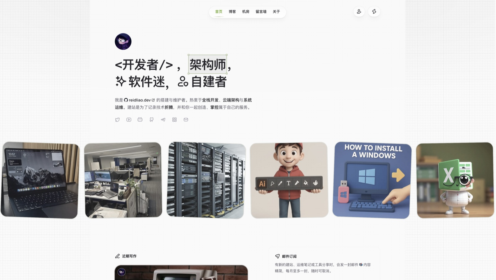

# reidliao.dev

[reidliao.dev](https://reidliao.dev) 个人技术博客源码。记录全栈建站、Docker 自建与系统运维的真实折腾，站点跑在自有 VPS 上。

> 本项目早期基于某个开源博客方案起步，现已深度定制，为站长独立维护的项目；原上游已不再维护。

[](https://reidliao.dev)

## 站点定位

- 自建部署：镜像、反代、环境变量与日志策略自行掌控
- 内容方向：全栈架构、容器化部署、运维实战、软件下载与自用机房推荐
- 在线地址：[https://reidliao.dev](https://reidliao.dev)
- 仓库地址：[https://github.com/ReidLiao/reidliao.dev](https://github.com/ReidLiao/reidliao.dev)
- 版本发布：[Releases](https://github.com/ReidLiao/reidliao.dev/releases)

## 技术栈

| 类别 | 选用 |
|------|------|
| 框架 | Next.js 14（App Router）+ Tailwind CSS |
| 包管理 | pnpm 8.15.8 |
| CMS | Sanity |
| 数据库 | Drizzle ORM + Neon PostgreSQL |
| 缓存 | Upstash Redis |
| 认证 | Clerk |
| 邮件 | Resend |
| 基础设施 | Docker、Dockge、Nginx Proxy Manager |

## 部署方式

面向小内存 VPS（本站为 2GB 内存档）采用**构建与运行分离**：**不要**在 VPS 上执行 `pnpm build` 或在服务器内构建镜像（易 OOM 死机）。

1. **本地构建**：开发机用 Docker Buildx 交叉编译 `linux/amd64`，并用 BuildKit secret 注入 `.env`（密钥不打进镜像层，同时满足 `next build` 校验）
2. **离线传输**：`docker save` 导出 `.tar`，经 SFTP 推到服务器后 `docker load`
3. **轻量运行**：Dockge / Compose 只跑预构建镜像（`image: reidliao-dev:latest`）；Nginx Proxy Manager 反代对外
4. **图片缓存卷**：挂载 `reidliao-img-cache:/data/img-cache`（见 `docker-compose.yml`），重建容器不丢 Sanity 图片代理缓存

### 本地构建示例

```bash
cp .env.example .env   # 按说明填入密钥（含 REVALIDATE_SECRET 等）

# 必须带 --secret；.dockerignore 已排除 .env
docker buildx build --platform linux/amd64 \
  --secret id=env,src=.env \
  -t reidliao-dev:latest --load .
```

### 发布到 VPS

```bash
docker save -o blog.tar reidliao-dev:latest
# 上传至服务器 /opt/stacks/reidliao-dev/ 后：
# docker load -i blog.tar，经 Dockge 更新/重新部署
```

环境变量说明见 [`.env.example`](./.env.example)。`.env` 不进 Git、不进镜像层。
内容发布后可通过 Sanity Webhook 调用 `/api/revalidate`（请求头 `x-revalidate-secret` 与 `.env` 中 `REVALIDATE_SECRET` 一致）即时刷新缓存。

## 本地开发

```bash
pnpm install
pnpm dev
```

需要数据库、Sanity、Clerk、Upstash、Resend 等环境变量时，参考 `.env.example`。

## 维护状态

本仓库由站长独立维护，是唯一的开发分支；原上游已不再维护。后续功能与体验改进均在此更新，正式版本见 [Releases](https://github.com/ReidLiao/reidliao.dev/releases)。源码公开，供学习与参考。
